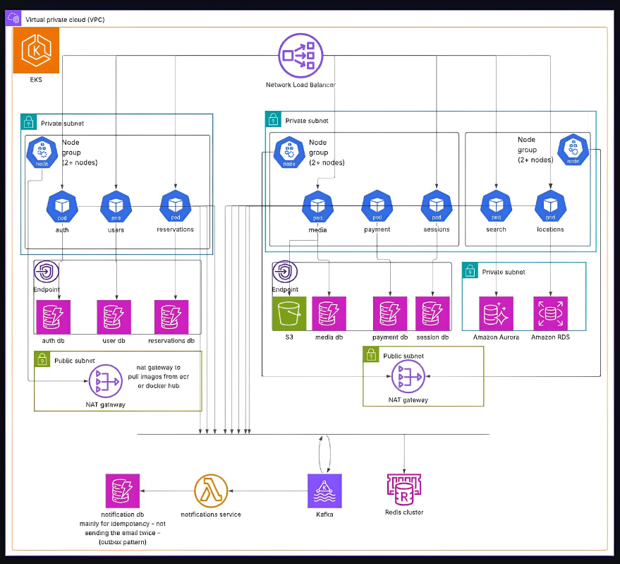

# SAA Manara – Platform Architecture

# Architecture Notes

Terraform for all of this is in [`src/`](src/). This doc just walks through what's actually in the diagram and why it's laid out this way — mostly so I remember my own reasoning in six months, but also useful if someone else has to touch this.

## Layout

Single VPC. EKS cluster in the middle, traffic comes in through a Network Load Balancer. Went with NLB over ALB here on purpose — almost everything downstream is internal TCP traffic between services, not HTTP traffic that needs path-based routing. Any L7 routing decisions happen inside the cluster via the ingress controller, not at the edge.

Three node groups, split by how the services behave rather than just spreading pods evenly:

| Node group | Services | Reasoning |
|---|---|---|
| 1 | `auth`, `users`, `reservations` | Core stuff, everything else depends on these. High request volume but cheap requests — lots of small reads, not much CPU. |
| 2 | `media`, `payment`, `sessions` | Traffic is spiky (checkout, uploads). Kept separate so a payment spike doesn't eat CPU/memory headroom that auth needs. |
| 3 | `search`, `locations` | Only two services that talk to relational DBs instead of DynamoDB. Different failure mode if a query goes bad, so isolated on its own node group. |

## Data layer

Most services get their own DynamoDB table — `auth db`, `user db`, `reservations db`, `media db`, `payment db`, `session db`. This wasn't a default choice, it's deliberate: each service owns its schema, and nobody has to coordinate a migration with another team because they happen to read the same table. Access patterns here are basically all get-by-id lookups, which is the exact case DynamoDB is built for, and pay-per-request billing means the low-traffic services aren't burning money sitting idle.

`search` and `locations` break that pattern. Search needs to scale reads separately from writes (hence Aurora, which supports read replicas cleanly), and locations does simpler geo/relational queries where plain RDS Postgres is enough — didn't see the point paying Aurora's premium there.

Media files go straight to S3, not into any database. The `media db` table next to it isn't storing the files, it's tracking metadata — owner, upload timestamp, processing status. Actual bytes never touch DynamoDB.

## Kafka / notifications / that weird little "notification db"

This part looks like over-engineering until you hit the actual problem: Kafka + Lambda gives you at-least-once delivery, not exactly-once. So a "payment failed" event can legitimately fire twice, and if the notifications Lambda just sends an email every time it sees an event, customers get duplicate emails.

The `notification db` table exists to solve exactly that. Before sending anything, the Lambda checks if it's already processed that event ID. Already processed → drop it. Not processed → send, then write the ID so it can't fire again. It's not a notification history store, it's purely an idempotency check — outbox pattern, basically, just implemented with DynamoDB instead of a dedicated outbox table.

## Redis

ElastiCache cluster sits off on its own, not owned by any single node group, since it's used across services — session lookups, caching reads that would otherwise keep hitting DynamoDB/Aurora/RDS for the same data. Gets its own subnet and security group because it's shared infra, not tied to one service's IAM boundary.

## Networking

Every node group and every database sits in a private subnet — no public IPs anywhere on compute or data. Public subnets only hold two things: the NAT gateways and the load balancer.

NAT gateways exist mainly so nodes can pull container images (ECR, Docker Hub) — that's the one thing that genuinely needs outbound internet access on a regular basis. Everything else that talks to AWS APIs a lot (S3, DynamoDB, ECR, STS, Secrets Manager, CloudWatch Logs) goes through VPC endpoints instead, so that traffic stays on AWS's internal network. Two upsides: it's cheaper (NAT gateways bill per GB processed) and it never has to leave AWS's network at all.

## IAM / IRSA

Didn't want one cluster-wide IAM role that can touch everything — that turns any single compromised pod into a path to every service's data. Each node group's service account maps to its own role instead:

- Core node group → read/write on `auth`, `users`, `reservations` tables only
- Commerce node group → `media`, `payment`, `sessions` tables + the S3 media bucket only
- Search node group → Secrets Manager access to pull Aurora/RDS credentials, no DynamoDB access at all

Keeps blast radius contained to whatever that service actually owns.

## Known gaps / what I'd fix next

- NLB target groups are static placeholders in the current Terraform. In a real deployment this needs to be the AWS Load Balancer Controller doing dynamic target registration off Kubernetes Service/Ingress objects — pod IPs aren't stable enough for a static config.
- No Kafka topic ACLs or schema registry yet. Fine with one producer, not fine once more than one team is publishing events.
- Autoscaling is one generic Cluster Autoscaler config right now. The three node groups have different enough traffic shapes (steady vs. bursty vs. query-heavy) that they should really have separate scaling policies.

## Where the code is

Terraform for all of this — VPC, EKS + node groups, DynamoDB tables, S3, Aurora, RDS, MSK, ElastiCache, the notifications Lambda, IAM/IRSA roles, security groups — lives under [`src/`](src/). `src/README.md` has the file-by-file breakdown and setup instructions.
